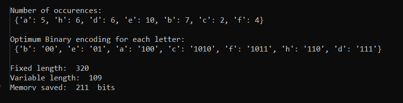

# Huffman Code Algorithm

Takes in a text file and outputs the ideal encoding of each letter based on the number of occurrences of that letter. The encodings are variable length meaning
more frequently occuring letters are encoded with shorter encodings and less frequent letters with longer encodings.

The difference between the total length of the file (in bits) using variable length encoding vs fixed length encoding (assuming fixed length of 8 bits) 
is also diaplayed

## Example Output

